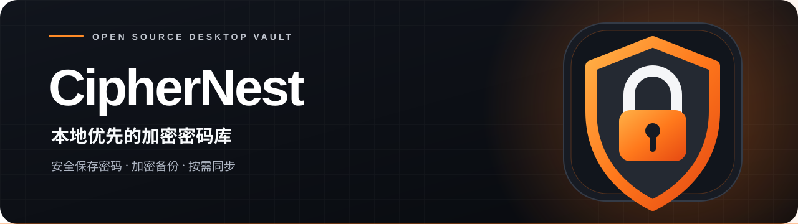

<p align="center">
  
</p>

<p align="center"><strong>本地优先的加密密码库</strong><br>安全保存密码 · 加密备份 · 按需同步</p>

<p align="center">
  <a href="https://github.com/qianshulab/CipherNest/releases/tag/v0.3.5"></a>
  <a href="LICENSE"></a>
</p>

<p align="center">
  <a href="#下载与安装">下载</a> ·
  <a href="#开始使用">快速开始</a> ·
  <a href="#更新与数据">升级与备份</a> ·
  <a href="#webdav-同步">WebDAV</a> ·
  <a href="#安全说明">安全</a> ·
  <a href="#从源码构建">开发</a>
</p>

## 项目简介

CipherNest 是一款面向 Windows、macOS 和 Linux 的密码管理器。账号与密码保存在本机加密保险库中，由主密码解锁；加密备份用于迁移与恢复，WebDAV 手动同步用于跨设备使用。项目采用 Tauri 2、Rust 和 TypeScript 构建。

<table>
  <tr>
    <td width="33%" valign="top">
      <br>
      <strong>本地保险库</strong><br>
      主密码解锁，账号与密码保存在本机。
    </td>
    <td width="33%" valign="top">
      <br>
      <strong>加密备份</strong><br>
      本机自动快照与手动导出，支持迁移和恢复。
    </td>
    <td width="33%" valign="top">
      <br>
      <strong>手动同步</strong><br>
      经 HTTPS WebDAV 按需同步，上传前加密。
    </td>
  </tr>
</table>

保险库支持搜索、筛选、排序、收藏和标签；条目较多时，列表分批显示。本地安全检查会提示部分常见口令、明显规律的密码、重复使用和长期未更新的密码；密码生成器支持自定义长度与字符类别。敏感字段默认遮罩，并可设置自动锁定、失焦锁定和剪贴板清除时间。

## 下载与安装

从 [GitHub Releases](https://github.com/qianshulab/CipherNest/releases) 下载与系统和架构对应的安装包。

| 系统 | 架构 | 安装包 |
| --- | --- | --- |
| Windows | x86-64 | `CipherNest-<版本>-Windows-x86_64-setup.exe` |
| macOS | Apple Silicon | `CipherNest-<版本>-macOS-aarch64.dmg` |
| Linux | x86-64 | `CipherNest-<版本>-Linux-x86_64.AppImage` 或 `.deb` |

每个版本同时提供 `SHA256SUMS.txt`，用于校验下载文件。当前安装包尚未取得 Windows 代码签名或 Apple 公证；macOS 包使用临时签名。应用没有自动更新功能，新版本需从 Releases 手动下载安装。

## 开始使用

1. 启动应用，设置至少 12 个字符的主密码。建议使用独有的长口令，并妥善保管。
2. 添加密码条目，或使用内置生成器创建密码。
3. 每次成功保存后，应用会在本机保留加密快照。另从设置中导出加密备份，将副本保存到另一块磁盘或离线介质。
4. 如需跨设备使用，在各设备上配置 [WebDAV 同步](docs/WEBDAV.md)。

CipherNest 不提供主密码重置服务。请妥善保存用于解锁保险库和各份加密备份的主密码。

## 更新与数据

保险库位于系统应用数据目录，与安装目录分开。相同应用标识符 `com.ciphernest.vault` 的新版本会沿用原数据目录。

| 系统 | 默认数据目录 |
| --- | --- |
| Windows | `%APPDATA%\com.ciphernest.vault\` |
| macOS | `~/Library/Application Support/com.ciphernest.vault/` |
| Linux | `$XDG_DATA_HOME/com.ciphernest.vault/`，未设置时通常为 `~/.local/share/com.ciphernest.vault/` |

> [!IMPORTANT]
> 升级前先导出一份加密备份，退出旧版应用，然后安装新版。安装后使用原主密码解锁，核对条目和同步设置。卸载时若系统提供清除应用数据的选项，请保留应用数据。

`vault.cnvault` 是本地保险库；`backups/` 保存本机自动加密快照。快照只覆盖已保存的数据，保存在同一应用数据目录中，不能代替异盘或离线备份。当前版本的快照无法确认时，应用会持续提示检查备份状态。手动导出的 `.cnvault` 文件可保存到用户选择的位置；已有目标文件不会被覆盖。备份策略、冲突保护和恢复步骤见[备份与恢复](docs/BACKUPS.md)。

配置 WebDAV 后，`vault.cnvault.sync` 保存本机加密同步配置。加密备份**不包含**该同步配置；迁移设备时还需保管同步恢复码和 WebDAV 凭据。

从 v0.3.1 或更早版本升级时，首次解锁会完成 v0.3.2 引入的密钥迁移。迁移后不要再用旧版程序打开同一保险库。已导出的旧备份仍使用导出时的主密码。

## WebDAV 同步

同步为可选功能，仅在保险库解锁后由用户手动触发。本机有未同步修改或无法确认同步状态时，界面会提示用户前往设置检查。请填写已存在、以 `/` 结尾的 HTTPS WebDAV 目录。服务器证书须受信任，并与访问时使用的域名或 IP 匹配；服务器还须通过应用内的同步能力检查。创建同步空间需要 WebDAV 用户名和密码；在新设备加入时还需要 `CN1.` 同步恢复码。

同步恢复码应与 WebDAV 密码分开保存。它不能重置主密码，WebDAV 同步也不能替代离线备份。配置步骤、证书要求和常见错误见 [WebDAV 使用说明](docs/WEBDAV.md)；协议细节见 [同步设计](docs/SYNC_DESIGN.md)。

## 安全说明

CipherNest 使用 Argon2id 从主密码派生密钥，使用 XChaCha20-Poly1305 加密保险库内容。同步数据在上传前使用独立密钥加密。安全模型和已知限制详见 [威胁模型](docs/THREAT_MODEL.md)。

本项目仍处于 beta 阶段，尚未经过独立安全审计。请使用独有的强主密码，并维护可验证的异盘或离线加密备份。发现安全问题请遵循 [安全政策](SECURITY.md)，不要在公开 Issue 中披露漏洞细节或真实凭据。

## 从源码构建

需要 Node.js 24、pnpm 10.12.1、Rust 1.89.0，以及目标系统的 [Tauri 2 构建依赖](https://v2.tauri.app/start/prerequisites/)。

```bash
corepack enable
corepack prepare pnpm@10.12.1 --activate
pnpm install --frozen-lockfile
pnpm desktop:dev
```

运行测试与生产构建检查：

```bash
pnpm check
```

构建当前系统的安装包：

```bash
pnpm desktop:build
```

构建产物位于 `src-tauri/target/release/bundle/`。各平台的构建与发布配置见 [发布说明](docs/RELEASING.md)。

## 参与贡献

缺陷报告和功能建议请提交至 [Issues](https://github.com/qianshulab/CipherNest/issues)。提交代码前请阅读 [贡献指南](CONTRIBUTING.md)。

## 许可证

[MIT License](LICENSE)。
